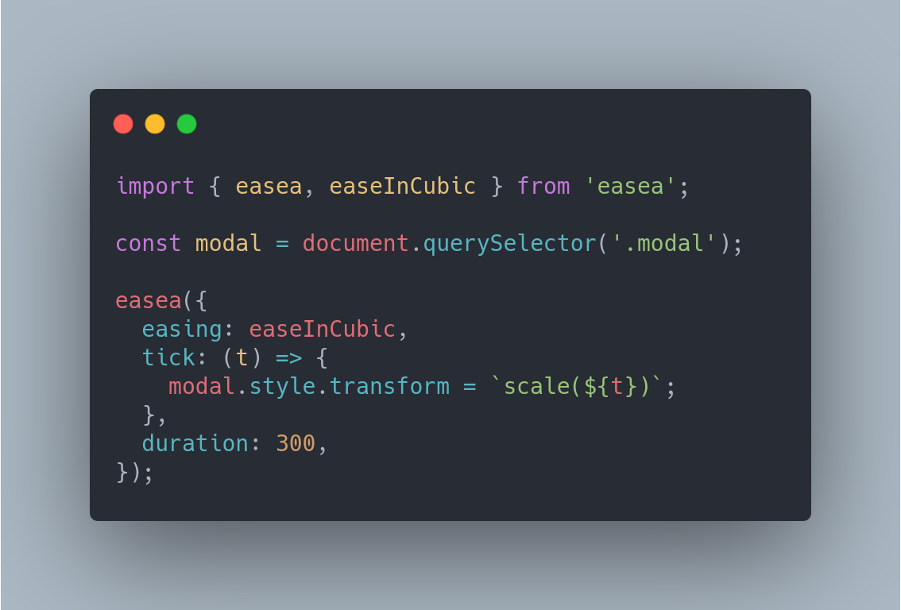

<p align="center">
  
</p>

<h1 align="center">Easae</h1>

<p align="center">A small utility for easy easing.</p>

---

## Install

```
npm i easae
```

## Usage

```ts
import { easae, easeInCubic } from 'easae';

const modal = document.querySelector('.modal');

easae({
  // Easing function you want to use, you can find the list further in the doc.
  easing: easeInCubic,
  // This function will be called on each tick of the easing.
  tick: (t, u) => {
    // 't' is going from 0 to 1 and 'u' is going from 1 to 0 (u = t * -1).

    // Bellow - as an example - we set the new scale of the modal.
    // But the idea is that you can animate anything in here using 't' and 'u'.
    modal.style.transform = `scale(${t})`;

    // For example we could set a React state:
    setProgressBarWidth(t * 100); // t * 100 so it's in %
  },
  // The duration of the easing in milliseconds
  duration: 300,
  // The delay before the easing starts in milliseconds (default is 0)
  delay: 100,
  // The refresh rate of the easing (default is 60)
  rate: 144,
});
```

## Inspiration

If you're familiar with [Svelte's animation API](https://svelte.dev/docs#animate_fn), you've probably noticed the resemblance.

## License

[MIT](LICENSE)
